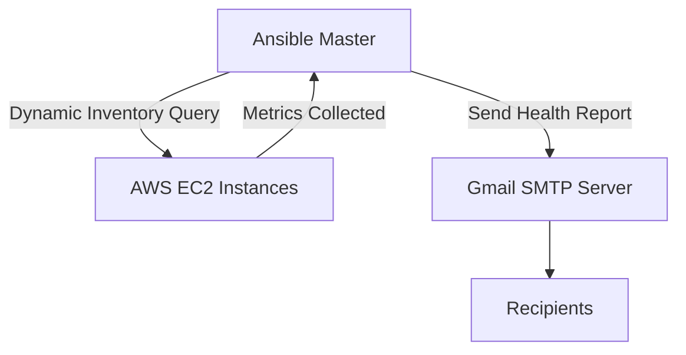
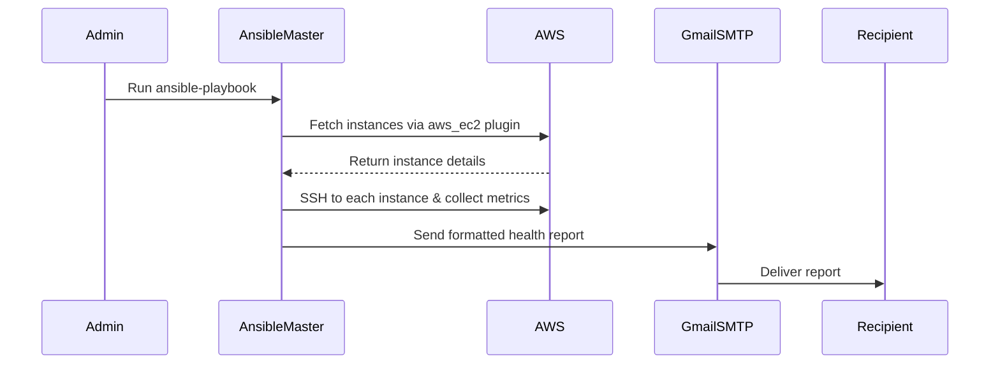

# Ansible-VM-Monitor

📬 **VM Health Monitoring & Reporting via Gmail**  
Ansible-based automation to collect CPU, memory, and disk usage from remote Linux VMs and send formatted health reports via Gmail SMTP to one or more recipients.  
Lightweight, secure, and easy to extend.

---

## 📌 Features
- Collects **CPU**, **Memory**, and **Disk usage** from AWS EC2 instances
- Uses **Dynamic Inventory** for automatic VM discovery
- Sends **HTML-formatted health reports** via Gmail SMTP
- **Secure key-based authentication**
- Easily extendable to more services and metrics

---

## 🛠 Architecture



---

## 📂 Workflow



---

## 📋 Prerequisites
- Ubuntu/Debian-based Ansible control machine
- AWS CLI configured with proper IAM permissions
- Gmail account with App Password enabled (for SMTP)
- Python 3.8+

---

## 🔧 Installation

### 1️⃣ Update the System
```bash
# Step 1: Update the System:
sudo apt update && sudo apt upgrade -y
```

### 2️⃣ Install Ansible
```bash
# Step 2: Add the Ansible PPA:
# Ansible provides an official maintained PPA (for latest versions):
sudo add-apt-repository --yes --update ppa:ansible/ansible

# Step 3: Install Ansible:
sudo apt install ansible -y
```

### 3️⃣ Install AWS CLI
```bash
curl "https://awscli.amazonaws.com/awscli-exe-linux-x86_64.zip" -o "awscliv2.zip"
sudo apt install unzip
unzip awscliv2.zip
sudo ./aws/install
aws configure
```

---

## 🏷 Tagging Script
```bash
#!/bin/bash

# Fetch instance IDs that match Environment=dev and Role=web
instance_ids=$(aws ec2 describe-instances   --filters "Name=tag:Environment,Values=dev" "Name=instance-state-name,Values=running"   --query 'Reservations[*].Instances[*].InstanceId'   --output text)

# Sort instance IDs deterministically
sorted_ids=($(echo "$instance_ids" | tr '\t' '\n' | sort))

# Rename instances sequentially
counter=1
for id in "${sorted_ids[@]}"; do
  name="web-$(printf "%02d" $counter)"
  echo "Tagging $id as $name"
  aws ec2 create-tags --resources "$id"     --tags Key=Name,Value="$name"
  ((counter++))
done
```

---

## 🔑 Generate Public/Private Key Pair
```bash
ssh-keygen -t rsa -b 4096 -C "Ansible-Master"
# Public key location: /home/ubuntu/.ssh/id_rsa.pub
```

---

## 📜 Dynamic Inventory Configuration — `inventory/aws_ec2.yaml`
```yaml
plugin: amazon.aws.aws_ec2
regions:
  - us-east-1
filters:
  tag:Environment: dev
  instance-state-name: running
compose:
  ansible_host: public_ip_address
keyed_groups:
  - key: tags.Name
    prefix: name
  - key: tags.Environment
    prefix: env
```

---

## 🐍 Create Python Virtual Environment for Ansible
```bash
# Step 1: Install venv module if not already present
sudo apt install python3-venv -y

# Step 2: Create a virtual environment
python3 -m venv ansible-env

# Step 3: Activate it
source ansible-env/bin/activate

# Step 4: Install required Python packages --To be installed in created virtual environment
pip install boto3 botocore docker
```

---

## 🔐 Create Ansible-Project.pem
```bash
# Create the file and paste the private key
sudo chmod 400 Ansible-Project.pem  # Provide only read access to the owner
```

---

## 📤 Copy Public Key to All Hosts
```bash
#!/bin/bash

# Define vars
PEM_FILE="Ansible-Project.pem"
PUB_KEY=$(cat ~/.ssh/id_rsa.pub)
USER="ubuntu"  # or ec2-user
INVENTORY_FILE="inventory/aws_ec2.yaml"

# Extract hostnames/IPs from dynamic inventory
HOSTS=$(ansible-inventory -i $INVENTORY_FILE --list | jq -r '._meta.hostvars | keys[]')

for HOST in $HOSTS; do
  echo "Injecting key into $HOST"
  ssh -o StrictHostKeyChecking=no -i $PEM_FILE $USER@$HOST "
    mkdir -p ~/.ssh &&     echo \"$PUB_KEY\" >> ~/.ssh/authorized_keys &&     chmod 700 ~/.ssh &&     chmod 600 ~/.ssh/authorized_keys
  "
done
```

---

## ▶ Run the Project
```bash
ansible-playbook playbook.yaml
```

---

## 📎 Repository
[GitHub: Kaushal-DevOps-Journey/Ansible-VM-Monitor](https://github.com/Kaushal-DevOps-Journey/Ansible-VM-Monitor)

---

## 🔒 Security Notes
- Never commit your `.pem` files or credentials to GitHub
- Use **IAM roles** with limited permissions
- Enable **Gmail App Passwords** instead of your main password

---

## 📜 License
MIT License

---

## 🤝 Contributions
PRs are welcome! Open an issue for discussion.
